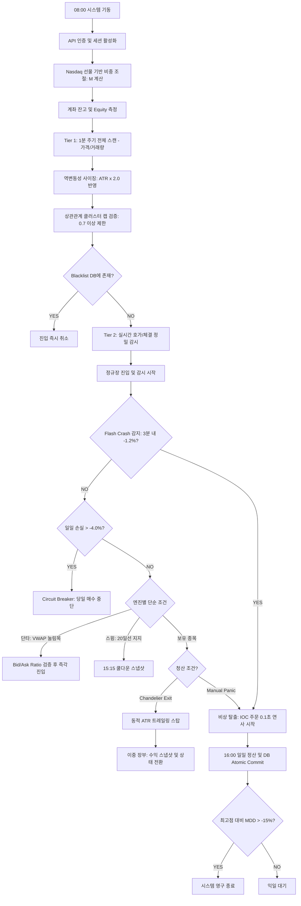

# [자동매매 시스템 플로우 차트 - 최종 고도화본 (Musk Applied)]

## 1. 아키텍처 개요
본 플로우 차트는 '최고의 부품은 없는 부품이다'라는 원칙에 따라, **지연을 유발하는 모든 실시간 연산을 제거**하고 **물리적 리스크 제어(Sizing & IOC)**에 집중한 설계입니다.

---

## 2. 통합 시스템 플로우차트 (Flowchart)

---

## 3. 핵심 업데이트 포인트 (Reformed Parts)

### A. 동적 비중 조절 (Beta Throttling)
- 나스닥 선물 수익률에 따라 $M$ 계수를 선형적으로 산출하여, 리스크가 높은 날은 자동으로 투입 금액을 축소합니다.

### B. 비동기 블랙리스트 (Async Blacklist)
- 실시간 NLP 지연을 제거하기 위해, 백그라운드에서 별도로 돌아가는 NLP 프로세스가 생성한 DB를 단순 조회만 하여 진입 속도를 극대화했습니다.

### C. IOC 연사 탈출 (Physical Exit)
- 급락 시 '희망 가격'에 팔리는 것을 기대하지 않습니다. 현재 호가에서 즉시 체결 가능한 물량을 0.1초 단위로 계속해서 긁어내는 IOC(Immediate or Cancel) 주문 방식으로 생존율을 높였습니다.
