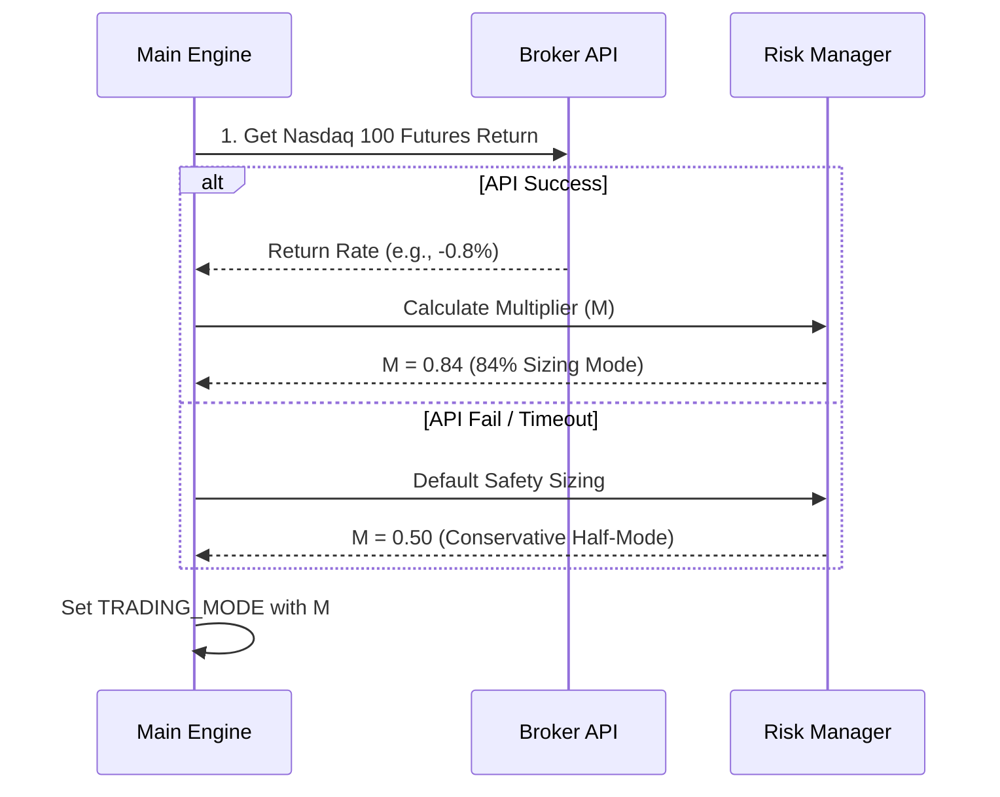
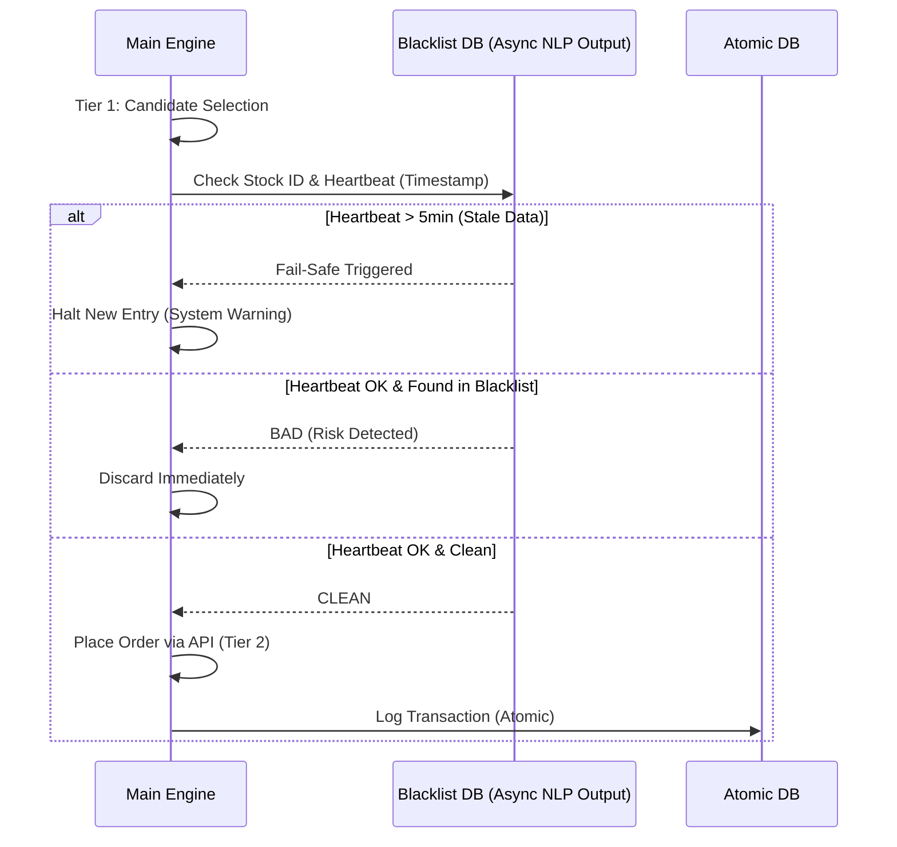
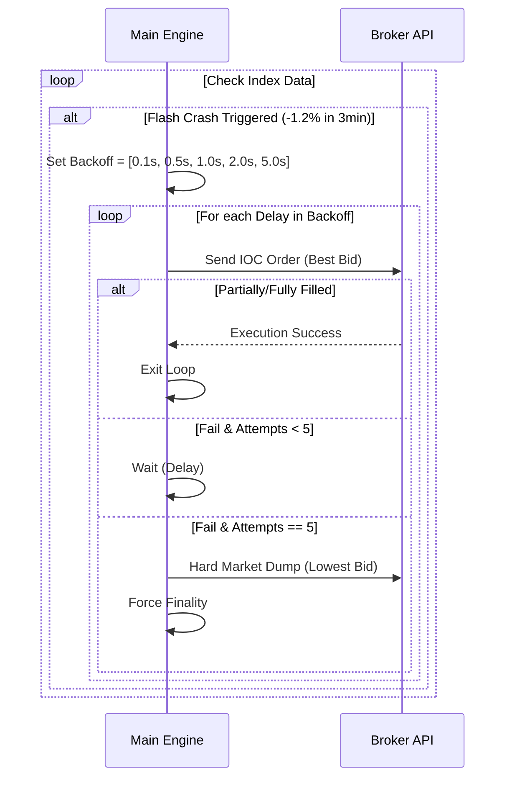
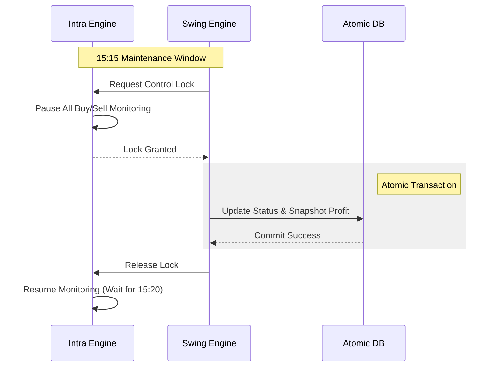

# [자동매매 시스템 시퀀스 다이어그램 - Extreme Simplicity]

## 1. Startup & Beta Throttling (08:30)
이진법적 사고를 버리고 매크로 위험을 선형적으로 수용하는 비중 조절 시작 시퀀스입니다.

---

## 2. Fast Entry Sequence (Async NLP Blacklist)
지연의 근원인 실시간 NLP를 제거하고, 오직 DB 조회만으로 진입 속도를 극대화했습니다.

---

## 3. Physical Emergency Exit (Exponential Backoff)
API BAN 리스크를 피하면서도 생존을 확정 짓는 비정한 탈출 시퀀스입니다.

---

## 4. 15:15 Lock-Step Morphing Sequence
경합 조건을 방지하고 데이터 무결성을 보장하는 마감 전환 시퀀스입니다.

